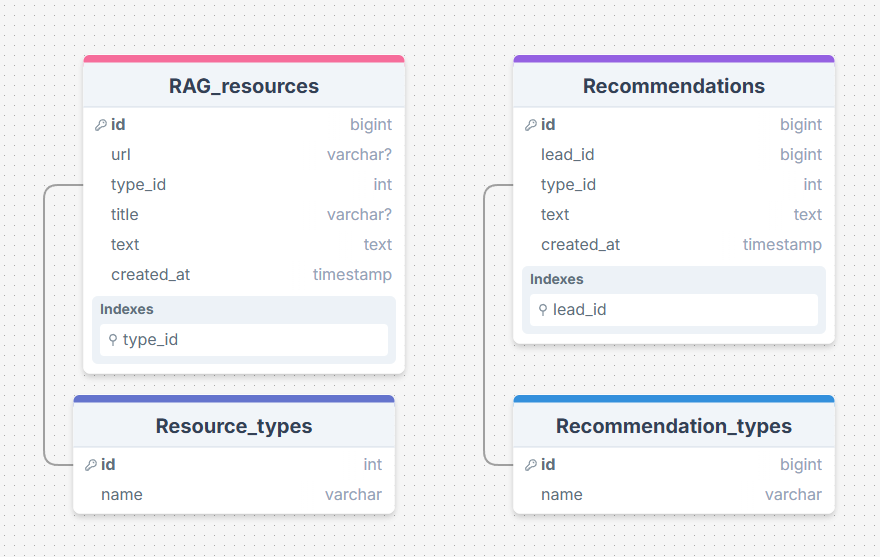

# Personalized Educational Course Recommendation System (RAG-based)

## 📌 Описание проекта

Система генерации персонализированных рекомендаций на основе цифрового следа пользователей. Система использует RAG (Retrieval-Augmented Generation) подход для создания релевантных рекомендаций, анализируя поведение пользователей и семантическое сходство курсов. 
Текущий репозиторий представляет ядро системы и API как основной интерфейс взаимодействия для пользовательских приложений.

## 🏗️ Архитектура проекта

```
├── src/
│   ├── rag_core/              # Ядро RAG-системы
│   ├── query_client/          # NATS-клиент для работы с очередью
│   ├── services/              # Сервисный слой 
│   ├── task_storage/          # Redis-клиент для поддержания актуальности статусов системы задач
│   ├── database/              # PostgreSQL + SQLAlchemy ORM
│   ├── vector_db/             # Qdrant интеграция
│   ├── api_client/            # Асинхронный клиент для LLM API
│   ├── mautic/                # Надстройка над ApiClient для работы с Mautic
│   ├── preprocessing/         # Модули препроцессинга и чанкирования
│   ├── api/                   # FastAPI слой
│   ├── config/                # Конфигурация приложения
│   ├── prompts/               # Системные промпты для LLM
│   ├── workers/               # Асинхронные воркеры для работы с LLM и Эмбеддиг моделью
│   └── utils/                 # Вспомогательные утилиты (логирование и т.д.)
├── tests/                     # Тесты
├── docs/                      # Документация
├── data/                      # Вспомогательные данные
├── scripts/                   # Скрипты для разработки и деплоя
├── docker-compose.yml         # Docker Compose конфигурация
├── pyproject.toml             # Единый конфиг Ruff/mypy и метаданные проекта
├── .pre-commit-config.yaml    # Конфигурация pre-commit хуков
└── .env.example               # Шаблон переменных окружения
```

## 🛠️ Технологический стек

- Python 3.12+
- Qdrant
- PostgreSQL
- Docker
- NATS
- Redis
- Ollama
- FastAPI
- Mautic API

## 🗄️ Структура базы данных

### 1. `resource_types` — Справочник типов ресурсов
### 2. `rag_resources` — Основное хранилище ресурсов (DataLake / staging-area)
### 3. `recommendation_types` — Справочник типов рекомендаций
### 4. `recommendations` — Хранилище сгенерированных рекомендаций

**Важные особенности:**
- Ресурсы **только добавляются**. Обновление и удаление **не поддерживаются**.
- После вставки ресура в `rag_resources` автоматически запускается задача на индексацию в векторную БД.



   
## Основные бизнес-процессы

1. Управление доступом к API
2. Индексация нового контента для RAG
3. Генерация персональных рекомендаций
4. Управление рекомендательной логикой (настройка промптов и параметров моделей)

Пункт **4** не описан диаграммой, это простая замена текста промптов.


   
   
   
## 🚀 Быстрый старт

### Предварительные требования

- Docker и Docker Compose
- Python 3.12+ (для локальной разработки)
- Git

### Установка через Docker

1. Клонируйте репозиторий:

```bash
git clone <repository-url>
cd <project-directory>
```

2. Создайте файл `.env` на основе `.env.example`:

```bash
cp .env.example .env
```

3. Запустите приложение:

```bash
docker compose up 
```

4. Проверьте работу контейнеров:

```bash
docker compose ps
```

5. Инициализация БД и запуск API :

```bash
python scripts\prepare_db.py --mode rebuild
python -m src.api
```


## 🔍 Качество кода

```bash
# Запуск Ruff для форматирования и линтинга
python -m ruff check --fix src/ tests/
python -m ruff format src/ tests/

# Проверка типов с mypy
python -m mypy src tests

# Запуск всех pre-commit хуков
python -m pre_commit run --all-files
```

### Структура коммитов

```
feat: добавление новой функциональности
fix: исправление ошибок
docs: обновление документации
style: изменения форматирования (без влияния на логику)
refactor: рефакторинг кода
test: добавление или исправление тестов
chore: обновление зависимостей, конфигураций
```