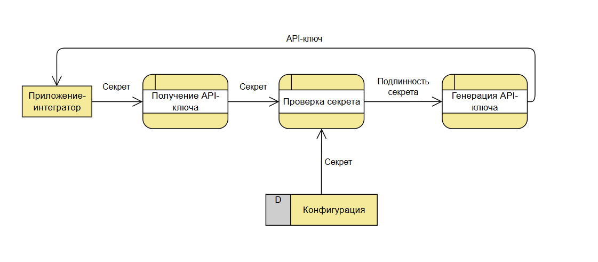
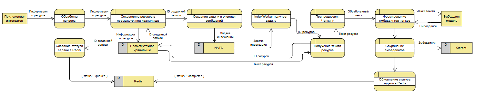
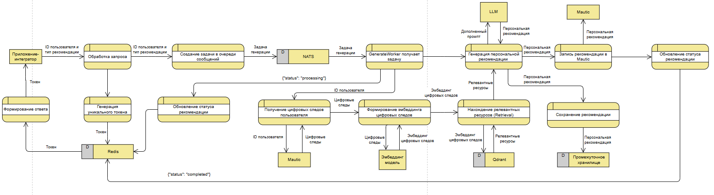

# RAG-based Personalized Educational Recommendation System

Система персонализированных рекомендаций образовательного контента на основе **Retrieval-Augmented Generation (RAG)**. Анализирует цифровой след пользователя из Mautic CRM, семантически ищет релевантный контент в векторной БД и генерирует персональные рекомендации через локальную LLM (Ollama).

---

## Содержание

1. [Архитектура](#архитектура)
2. [Технологический стек](#технологический-стек)
3. [Структура проекта](#структура-проекта)
4. [База данных](#база-данных)
5. [Бизнес-процессы](#бизнес-процессы)
6. [Быстрый старт](#быстрый-старт)
7. [Конфигурация](#конфигурация)
8. [API](#api)
9. [Качество кода](#качество-кода)

---

## Архитектура

Система состоит из двух самостоятельных процессов, общающихся через очередь сообщений:

```
┌──────────────────────────────────────────────────────────────────┐
│  Клиентское приложение                                           │
└────────────────────────┬─────────────────────────────────────────┘
                         │ HTTP
┌────────────────────────▼─────────────────────────────────────────┐
│  API (FastAPI)                                                   │
│  • Выдача JWT-токенов                                            │
│  • Управление контентом (staging area)                           │
│  • Запуск задач генерации / индексации                           │
│  • Чтение готовых рекомендаций из PostgreSQL                     │
└────────────┬───────────────────────────────┬─────────────────────┘
             │ NATS JetStream                │ PostgreSQL / Redis
┌────────────▼───────────────────────────┐   │
│  Workers                               │   │
│  ┌─────────────────────────────────┐   │   │
│  │ IndexWorker                     │◄──┤   │
│  │  • Читает ресурс из staging     │   │   │
│  │  • Чанкирует текст              │   │   │
│  │  • Получает эмбеддинги          │   │   │
│  │  • Загружает в Qdrant           │   │   │
│  └─────────────────────────────────┘   │   │
│  ┌─────────────────────────────────┐   │   │
│  │ GenerateWorker                  │◄──┘   │
│  │  • Читает цифровой след         │       │
│  │  • Семантический поиск в Qdrant │       │
│  │  • Рендерит промпт              │       │
│  │  • Вызывает LLM                 │       │
│  │  • Сохраняет рекомендацию       │───────►
│  └─────────────────────────────────┘
└────────────────────────────────────────┘
```

---

## Технологический стек

| Компонент | Роль |
|-----------|------|
| **Python 3.12** | Основной язык |
| **FastAPI** | REST API |
| **NATS JetStream** | Очередь задач (индексация / генерация) |
| **Redis** | Хранение статусов async-задач |
| **PostgreSQL + SQLAlchemy** | Реляционное хранилище ресурсов и рекомендаций |
| **Qdrant** | Векторная БД для семантического поиска |
| **Ollama** | Локальный LLM-бэкенд |
| **Embedding API** | Модель для векторизации (nomic-embed-text и др.) |
| **Mautic** | CRM-источник цифрового следа пользователей |

---

## Структура проекта

```
src/
├── rag_core/              # ★ Ядро RAG-системы (вся бизнес-логика RAG здесь)
│   ├── schemas.py         #   Типы данных: RetrievedCourse, RetrievedResourceRecord и др.
│   ├── embeddings.py      #   Получение эмбеддингов, нормализация векторов
│   ├── indexer.py         #   Индексация курсов в Qdrant (чанки + эмбеддинги)
│   ├── retriever.py       #   Семантический поиск, фильтрация по типу ресурса
│   ├── prompt_builder.py  #   Формирование промптов (типизированные + курсовые)
│   ├── parser.py          #   Парсинг JSON-ответа LLM
│   ├── llm.py             #   Вызов LLM API, извлечение текста из ответа
│   ├── generator.py       #   Фасад: generate_course_recommendation()
│   └── pipeline.py        #   RAGPipeline — полный цикл (retrieve → prompt → generate)
│
├── services/              # Сервисный слой (оркестрация, задачи, аудит)
│   ├── recommendations.py #   RecommendationGenerationService, RecommendationsQueryService
│   ├── indexing.py        #   ResourceIndexingService — управление задачами индексации
│   ├── staging_area.py    #   StagingAreaService — CRUD ресурсов, импорт email из Mautic
│   ├── catalog.py         #   CatalogService — справочники типов
│   ├── recommendation_audit.py  # Аудит-лог каждого шага генерации в JSON
│   └── errors.py          #   Иерархия исключений
│
├── api/                   # FastAPI-приложение
│   ├── main.py            #   Создание app, lifespan, подключение роутеров
│   ├── routers/           #   По роутеру на группу эндпоинтов
│   ├── auth.py            #   JWT-валидация зависимости
│   └── schemas.py         #   Pydantic-схемы запросов/ответов
│
├── workers/               # Async NATS-воркеры
│   ├── generate_worker.py #   Слушает tasks.rag.generate → запускает GenerateService
│   └── index_worker.py    #   Слушает tasks.rag.index → чанкирует и индексирует
│
├── preprocessing/         # Предобработка данных
│   ├── chunker.py         #   Разбивка текста на чанки (LangChain splitter)
│   ├── digital_footprints.py  # Построение семантического профиля из событий Mautic
│   └── embeddings.py      #   Формирование passage/query инпутов для embedding-модели
│
├── database/              # PostgreSQL + SQLAlchemy ORM
│   ├── models.py          #   ORM-модели таблиц
│   ├── repositories.py    #   Репозитории (CRUD-операции)
│   └── session.py         #   Управление сессиями, create_tables
│
├── vector_db/             # Qdrant-клиент
│   └── qdrant_client.py   #   Async-обёртка над qdrant-client
│
├── api_client/            # HTTP-клиент для внешних сервисов
│   └── api_client.py      #   ApiClient с factory-методами for_llm / for_embeddings
│
├── mauitc/                # Интеграция с Mautic CRM
│   ├── mauitic_client.py  #   MauticClient — получение событий, стадий, сохранение рекомендации
│   └── activity_reader.py #   Парсинг Mautic activity events в унифицированный формат
│
├── query_client/          # NATS-клиент для публикации задач
│   └── nats_client.py     #   RAGTasksClient — publish_generate / publish_index / subscribe
│
├── task_storage/          # Redis-клиент для статусов задач
│   └── redis_client.py    #   RedisClient — get/set/list статусов задач
│
├── config/
│   └── settings.py        #   AppSettings (pydantic-settings) + get_settings()
│
├── prompts/               # Шаблоны промптов для LLM
│   ├── cold.txt           #   Для холодных лидов
│   ├── warm.txt           #   Для тёплых лидов
│   ├── hot.txt            #   Для горячих лидов
│   ├── after_sale.txt     #   Для постпродажного этапа
│   └── recommendation_prompt.txt  # Универсальный промпт для RAGPipeline
│
└── utils/
    └── logging.py         #   Настройка JSON-логирования
```

---

## База данных

### Схема

```
resource_types           rag_resources
┌────────────────┐       ┌─────────────────────────────────┐
│ id (PK)        │◄──┐   │ id (PK)                         │
│ name           │   └───│ resource_type_id (FK)           │
└────────────────┘       │ title                           │
                         │ url                             │
                         │ text                            │
                         │ text_hash (unique)  ← дедупл.  │
                         │ created_at                      │
                         └─────────────────────────────────┘

recommendation_types     recommendations
┌────────────────┐       ┌─────────────────────────────────┐
│ id (PK)        │◄──┐   │ id (PK)                         │
│ name           │   └───│ recommendation_type_id (FK)     │
└────────────────┘       │ lead_id                         │
                         │ text (JSON payload)             │
                         │ created_at                      │
                         └─────────────────────────────────┘
```

**Ключевые особенности:**
- Ресурсы **только добавляются**. Обновление и удаление не поддерживаются.
- После добавления ресурса API автоматически публикует задачу на индексацию в NATS.
- `text_hash` на `rag_resources` предотвращает дублирование идентичного контента.

---

## Бизнес-процессы

### 1. Авторизация

Клиент обменивает секрет (`API_AUTH_SECRET`) на JWT-токен через `POST /auth/key`. Все остальные эндпоинты требуют `Authorization: Bearer <token>`.



### 2. Индексация контента

```
POST /staging-area          → добавить ресурс в БД
                            → воркер получает задачу из NATS
                            → split_text() → fetch_embedding() → Qdrant.upsert()
```

Поддерживаются любые типы ресурсов (course, article, mautic_email и др.) — типы предварительно регистрируются через `POST /staging-area/resources/type`.



### 3. Генерация рекомендации

```
POST /recommendations/generate  → task_id в Redis (статус queued)
                                → воркер получает задачу из NATS
                                → определяет тип рекомендации по стадии лида в Mautic
                                → загружает digital footprint из Mautic
                                → build_digital_footprint_profile_text()
                                → fetch_embedding() → Qdrant.search_with_filter()
                                → render_typed_prompt()
                                → generate_llm_response()
                                → сохраняет в PostgreSQL + Mautic CRM

GET /recommendations/status/{token}  → статус из Redis
GET /recommendations/{lead_id}       → готовые рекомендации из PostgreSQL
```

Генерация **идемпотентна** — повторный запрос с тем же `task_id` вернёт уже готовый результат.



### 4. Управление промптами

Промпты хранятся как текстовые файлы в `src/prompts/`. Каждому типу лида соответствует свой шаблон (`cold.txt`, `warm.txt`, `hot.txt`, `after_sale.txt`). Содержимое можно обновлять через API:

```
GET /prompt?lead_type=cold   → посмотреть текущий промпт
PUT /prompt                  → обновить промпт
```

---

## Быстрый старт

### Предварительные требования

- Docker и Docker Compose
- Python 3.12+ (для локальной разработки без Docker)

### Запуск через Docker

```bash
# 1. Клонировать репозиторий
git clone <repository-url>
cd <project-directory>

# 2. Создать .env из шаблона и заполнить значения
cp .env.example .env

# 3. Запустить инфраструктуру
docker compose up -d

# 4. Проверить статус контейнеров
docker compose ps
```

### Инициализация базы данных

```bash
# Создать таблицы и заполнить справочники
python scripts/prepare_db.py --mode rebuild
```

### Запуск приложения

```bash
# API (порт 8000 по умолчанию)
python -m src.api

# Воркеры (в отдельном терминале)
python -m src.workers
```

### Первые шаги

```bash
# 1. Получить JWT-токен (секрет из .env → API_AUTH_SECRET)
curl -X POST http://localhost:8000/auth/key \
     -H "Content-Type: application/json" \
     -d '{"secret": "your-secret"}'

# 2. Добавить ресурс (статью или курс)
curl -X POST http://localhost:8000/staging-area \
     -H "Authorization: Bearer <token>" \
     -H "Content-Type: application/json" \
     -d '{"resource_type": "article", "title": "Python для начинающих",
          "text": "Полное руководство...", "url": "https://example.com/python"}'

# 3. Запустить генерацию рекомендации
curl -X POST http://localhost:8000/recommendations/generate \
     -H "Authorization: Bearer <token>" \
     -H "Content-Type: application/json" \
     -d '{"lead_id": "12345"}'

# 4. Проверить статус
curl http://localhost:8000/recommendations/status/<task_id> \
     -H "Authorization: Bearer <token>"

# 5. Получить рекомендации
curl http://localhost:8000/recommendations/12345 \
     -H "Authorization: Bearer <token>"
```

---

## Конфигурация

Все параметры задаются через переменные окружения (файл `.env`).

| Переменная | Описание | По умолчанию |
|-----------|----------|--------------|
| `POSTGRES_HOST` | Хост PostgreSQL | `localhost` |
| `POSTGRES_PORT` | Порт PostgreSQL | `5432` |
| `POSTGRES_DB` | Имя базы данных | — |
| `POSTGRES_USER` | Пользователь БД | — |
| `POSTGRES_PASSWORD` | Пароль БД | — |
| `QDRANT_HOST` | Хост Qdrant | `localhost` |
| `QDRANT_PORT` | Порт Qdrant | `6333` |
| `QDRANT_COLLECTION` | Имя коллекции | — |
| `REDIS_HOST` | Хост Redis | `localhost` |
| `REDIS_PORT` | Порт Redis | `6379` |
| `NATS_HOST` | Хост NATS | — |
| `NATS_PORT` | Порт NATS | `4222` |
| `NATS_STREAM_NAME` | Имя JetStream стрима | — |
| `LLM_API_URL` | URL Ollama / LLM API | — |
| `LLM_MODEL` | Модель LLM (напр. `llama3`) | — |
| `LLM_REQUEST_TIMEOUT_SECONDS` | Таймаут LLM-запроса | `null` (общий) |
| `EMBEDDING_MODEL_API_URL` | URL embedding API | — |
| `EMBEDDING_MODEL` | Имя embedding-модели | — |
| `EMBEDDING_VECTOR_SIZE` | Размерность вектора | `768` |
| `MAUTIC_API_URL` | URL Mautic | — |
| `MAUTIC_USER` | Логин Mautic | — |
| `MAUTIC_PASSWORD` | Пароль Mautic | — |
| `MAUTIC_RECOMMENDATION_FIELD` | Alias поля в Mautic | `recommendation_by_rag` |
| `MAUTIC_RECOMMENDATION_MAX_LENGTH` | Макс. длина текста в Mautic | `900` |
| `API_AUTH_SECRET` | Секрет для выдачи JWT | `change-me` |
| `API_JWT_EXPIRATION_SECONDS` | Срок жизни токена | `2592000` (30 дней) |
| `RECOMMENDATION_AUDIT_LOG_DIR` | Директория аудит-логов | `logs/recommendations` |
| `LOG_LEVEL` | Уровень логирования | `INFO` |

---

## API

Полная документация всех 22 эндпоинтов — в [`docs/API.md`](docs/API.md).

Интерактивная документация (Swagger UI) доступна по адресу:

```
http://localhost:8000/docs
```

### Краткий список эндпоинтов

| Метод | Путь | Описание |
|-------|------|----------|
| `GET` | `/system/health` | Статус всех компонентов системы |
| `POST` | `/auth/key` | Получить JWT-токен |
| `POST` | `/staging-area` | Добавить ресурс для RAG |
| `GET` | `/staging-area/{id}` | Получить ресурс |
| `POST` | `/staging-area/email` | Импорт email из Mautic |
| `POST` | `/staging-area/resorces/type` | Зарегистрировать тип ресурса |
| `POST` | `/staging-area/recommendations/type` | Зарегистрировать тип рекомендации |
| `POST` | `/recommendations/generate` | Запустить генерацию |
| `GET` | `/recommendations/status/{token}` | Статус задачи генерации |
| `GET` | `/recommendations/{lead_id}` | Готовые рекомендации лида |
| `GET` | `/recommendations/actions/{lead_id}` | Цифровой след лида из Mautic |
| `GET` | `/recommendations/tasks/{lead_id}` | История задач генерации |
| `GET` | `/prompt?lead_type=...` | Получить промпт |
| `PUT` | `/prompt` | Обновить промпт |
| `POST` | `/vector-db/rebuild` | Перестроить весь векторный индекс |
| `GET` | `/vector-db/status` | Статус векторной БД |
| `GET` | `/vector-db/resource-status/{id}` | Статус индексации ресурса |
| `POST` | `/mautic/field` | Создать поле у всех контактов Mautic |
| `PATCH` | `/mautic/field` | Заполнить поле для конкретного контакта |
| `GET` | `/mautic/contact/check` | Проверить уникальность контакта в Mautic по email |

---

## Качество кода

```bash
# Линтинг и автоисправление
python -m ruff check --fix src/ tests/

# Форматирование
python -m ruff format src/ tests/

# Проверка типов
python -m mypy src tests

# Запуск тестов
python -m pytest tests/unit/

# Все pre-commit хуки разом
python -m pre_commit run --all-files
```

### Конвенция коммитов

```
feat:     новая функциональность
fix:      исправление ошибок
refactor: рефакторинг без изменения поведения
docs:     обновление документации
test:     добавление / исправление тестов
chore:    зависимости, конфиги, инфраструктура
style:    форматирование (без влияния на логику)
```
